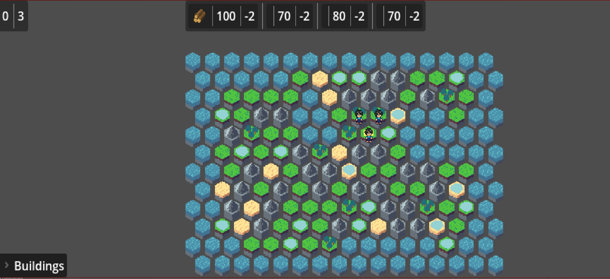
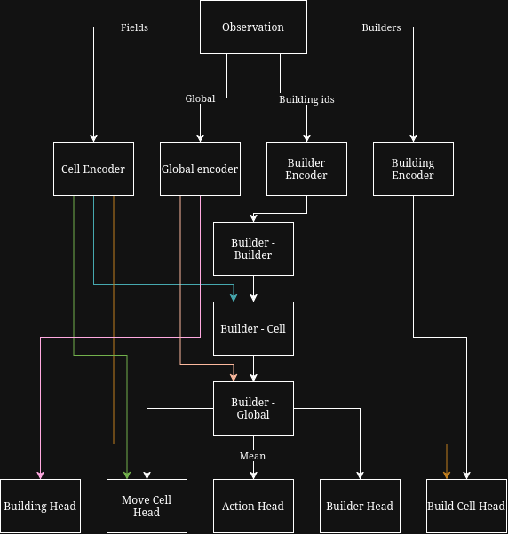

# Strategy Resource Godot

This is a W.I.P. project to create strategy game in Godot Engine and train RL agent to play it. Game consists of placing buildings and moving builders to target field on hex grid to start construction. The goal of the game is to build all required buildings in the shortest time possible, without running out of resources. Game is turn based and as many action as possible can be done in one turn. Actions include:
- placing building - more than one building can be placed, limitation is the amount of needed resources and terrain type ex. Timber can only be placed on field with forest, Mines can only be placed near mountains, etc. 
- moving builder - builders can be moved to any field on the map if there is a path to it, by default they can move 1 field per turn, but there are some buildings that can increase this value, 
- go to next turn - this action gathers all resources based on current production, moves builders to next field in their path and if builder is on the field with building under construction, it contributes to its construction, which by default adds 1 to progress and can also be altered by special buildings. When building is fully constructed, it starts producing resources.

Connection between game and RL agent is done via socket connection, game sends current state of the game to the agent and waits for action to be sent back. This allows for easy integration of different RL libraries and frameworks, as well as for training agents on different machines.

## Current state
Currently the game is in early development stage, game is more or less playable, but needs tuning of balancing which might be achieved with help of RL agent. Also some fixes in the RL lib are necessary to enable efficient batched training.

## Game screen shot

## NN architecture
To ensure AI agent uses all the available information and make decisions based on them, few things had to be known in observation:
- current global state - this includes current turn, amount of resources and current production, 
- state of the map - this includes terrain type, building type and construction progress for each field on the map,
- state of the builders - this includes current position and path for each builder.

These need to be combined in order for agent to reason about the game and make informed decisions. To achieve this, a custom NN architecture was designed, which are:
- global state encoder - this is a simple MLP that takes in the global state and outputs a fixed size vector representation of it,
- cells encoder - also a simple MLP that takes in the state of each cell and outputs a fixed size vector representation of it, this is done for each cell on the map,
- builders encoder - same as in cells encoder, but for builders,
- building type embedding - this is a simple embedding layer that takes in the building type and outputs a fixed size vector representation of it, this is used so that agent can choose correct building type to place based on current state of the game,
- 3 attention layers - builder-cell attention, builder-global attention and builder-builder attention, this allows to move builders more efficiently by attending to the most relevant cells and global state, as well as to coordinate builders between each other,
- 6 heads - action head, builder head, building head, move_cell head, build_cell head and value head - these heads are responsible for outputting the action to be taken, which builder to move, which building to place, where to move the builder and where to place the building, as well as the value of the current state for training the agent.

Network can take different actions, which are:
- place building - this action requires choosing which building to place and where to place it, this is done by building head and build_cell head,
- move builder - this action requires choosing which builder to move and where to move it, this is done by builder head and move_cell head,
- go to next turn - this action does not require any additional information, so only action head is used.

This architecture allows for efficient processing of the game state and making informed decisions based on it. Also in case there are no builders on the map, builder related parts of the network can be ignored and only global state and cells are used to make decisions about placing buildings, which is crucial in the early game when there are no builders on the map yet.

Network utilizes masking to ensure that only valid actions are taken, for example if there are no builders on the map, builder related actions are masked out, if there are no resources to place a building, building related actions are masked out, etc. This allows for more efficient training and better performance of the agent.

### NN architecture diagram

